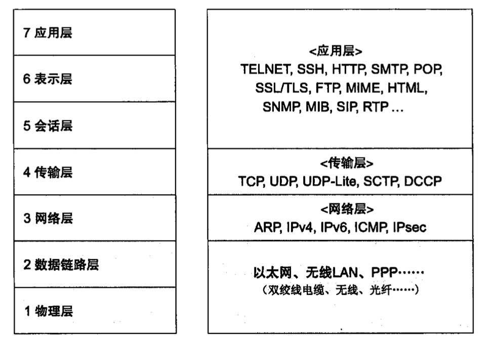
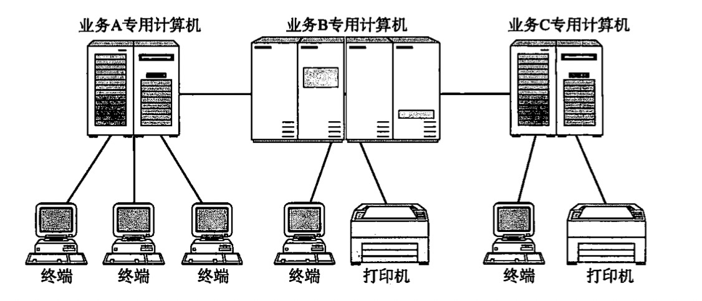
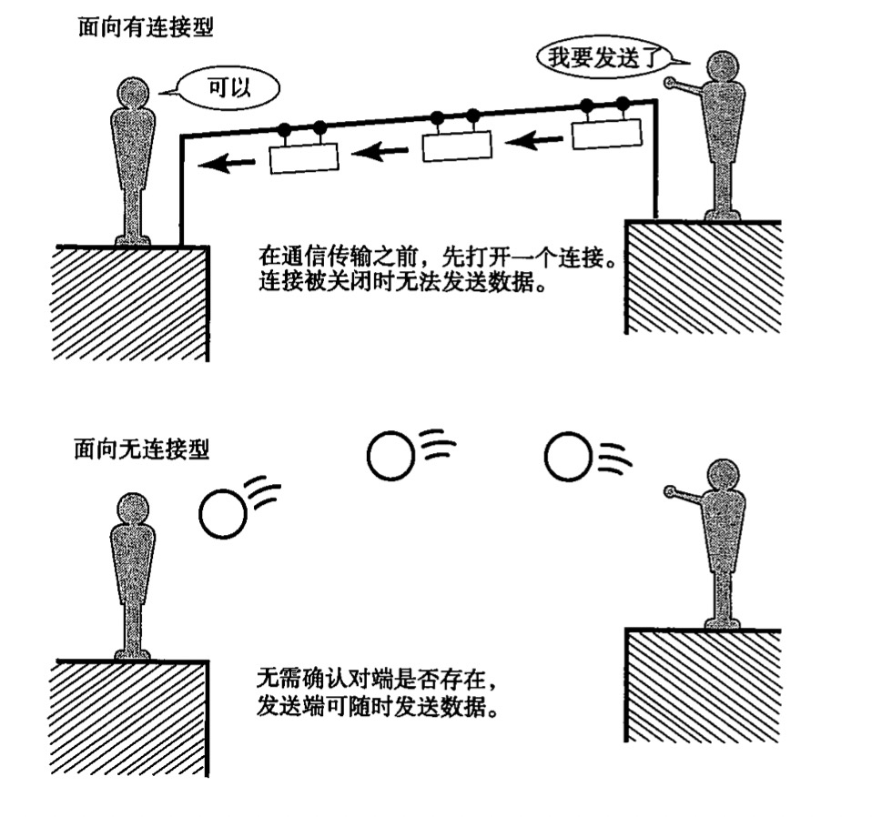

# 第 1 章 网络基础知识

计算机与网络发展历史及标准化过程、OSI参考模型、网络概念本质、网络构件的设备

## 计算机网络出现的背景

起初，计算机以**单机模式**被广泛使用，也叫独立模式，即未连接到网络、各自独立使用的方式

将一个个计算机连接在一起，即形成**计算机网络**，根据规模分为 WAN（Wide Area Network，广域网） 和 LAN（Local Area Network，局域网）

最初是由管理员将特定的几台计算机连到一起形成计算机网络，是私有的网络，后来人们不断尝试将私有网络相互连接形成更大的私有网络，之后又逐渐演变成为互联网，互联网中的任何两台计算机都能通信，再后来各种各样的终端都接入互联网，形成现在的综合通信环境。

计算机网络就好比人的神经系统，神经能将各处的感觉传递到大脑，网络能将世界各地的信息传递到你的计算机中。

## 计算机与网络发展的 7 个阶段

了解计算机与网络发展的历史与现状，能更好的理解 TCP/IP 的重要性

年代            | 内容
:--------------|:----------------------
20 世纪 50 年代 | 批处理时代
20 世纪 60 年代 | 分时系统时代
20 世纪 70 年代 | 计算机间通信时代
20 世纪 80 年代 | 计算机网络时代
20 世纪 90 年代 | 互联网普及时代
2000 年         | 以互联网为中心的时代
2010 年         | 无论何时何地一切皆 TCP/IP 的网络时代

### 批处理（Batch Processing）

20 世纪 50 年代

事先将用户程序和数据装入卡带或磁带，并由计算机按照一定的顺序读取，使用户所要执行的这些程序和数据能够一并批量得到处理的方式

这种计算机价格昂贵体积巨大，通常放置于专门进行计算机管理于运维的计算机中心，用户除了事先将程序和数据装入卡带或磁带带到中心去运行之外别无他法

操作相当复杂，有专门的操作员负责实际运行程序，用户较多时只能过些时日再来取结果

彼时的计算机主要用于大规模计算或处理，不是普通人使用的工具

### 分时系统（Time Sharing System，TSS）

20 世纪 60 年代出现

多个终端（由键盘、显示器等输入输出设备组成）与同一个计算机连接，允许多个用户同时使用一台计算机的系统（原理与 CPU 的多任务调度同）

彼时计算机造价昂贵，无法一人一台，分时系统则可以假装“一人一台”，用户感觉“完全是自己在使用一台计算机”，这体现了分时系统的**独占性**

> 分时系统的重要特性：**多路性**、**独占性**、**交互性**、**及时性**

它的交互式（对话式）操作使计算机变得更加人性化，并且促进了像 BASIC 这样能够与计算机实现交互的编程语言的发展，而在此之前的 COBOL 和 FORTRAN 等计算机编程语言都必须以批处理系统为基础才能开发和运行

> BASIC 语言的发明是为了让更多的人学习如何编程，可以说是关注分时系统的初学者们的必学语言

此时每个终端与计算机之间通信线路构成了星型结构，从这时开始，网络通信与计算机之间的关系开始显现。小型机随集产生，办公场所与工厂也逐渐引入计算机

分时系统中一个计算机与多个终端使用通信线路连接，但两个计算机之间还是无法连接

### 计算机之间的通信

20 世纪 70 年代，计算机性能飞速发展，体积小型化，价格急剧下降，企业也开始使用，为了提高工作效率，人们开始研究计算机之间的通信技术

> 计算机之间通信技术诞生前，计算机间转移数据需要使用磁带、软盘等外部存储介质

### 计算机网络的产生

20 实际 80 年代

能够连接各式各样的计算机的网络诞生

窗口系统的发明让人们更加便捷的使用计算机，拉近与网络的距离，开始愉快的网上冲浪，享受网上的丰富资源

### 互联网的普及

20 世纪 90 年代

连接异构型计算机的通信网络技术就是现在的互联网技术，此时万维网（World Wide Web，WWW）等信息传播方式也迎来了大发展，互联网进入每个家庭内部

> **瘦身**
> 
> 20 世纪 90 年代上半叶，由于使用个人电脑与 UNIX 工作站搭建网络比大型主机更有优势，操作简单且价格低廉，由此引发了一个旨在降低网络架构成本的新趋势，被称为“瘦身”

### 以互联网技术为中心的时代

许多发展道路各不相同的网络技术都向互联网靠拢。

例如，电话网曾经一直作为通信基础设施、支撑通信网络，其地位目前已被 IP（Internet Protocol）网所取代，而 IP 网本身就是互联网技术的产物。通过 IP 网，不仅可以实现电话通信、电视播放，还能实现计算机间的通信，建立互联网。而且能联网的设备也是扩展到了各种电子产品。

### 从“单纯简历连接”到“安全简历连接”

互联网给了我们高度便捷的信息网络环境，正成为社会基础设施建设中最基本的要素之一，但其也带来了负面问题，如计算机病毒、信息泄露、网络欺诈等等。

故而现在人们更加追求安全建立连接

### 手握金刚钻的 TCP/IP

能够使许多独立发展的网络通信技术融合并实现统一的正是 TCP/IP 技术，它是通信**协议**的统称

## 协议

**TCP/IP** 是一种网络体系结构，是 IP、TCP、UDP、HTTP、SMTP 等一系列协议的集合，主要用于互联网、局域网。此外也有很多其他类型的网络体系结构以及协议

**协议**就是计算机之间通信时实现达成的一种约定，可以使得不同设备、CPU（Central Processing Unit）、操作系统（Operating System，OS）都可以实现通信

例如平常聊天中，使用的语言就是协议，聊天就是通信，而说话的内容就是要传递的数据，只有两人协议相同时才能完成聊天

### 分组交换协议

将大数据分割成一个个称为**包**（Packet）的较小单元进行传输的方法

在每一个分组中附加源主机地址和目标主机地址送给通信线路，这些发送端地址、接收端地址以及分组序号写入的部分称为**报文首部**，这都已经规定在通信协议中

## 协议由谁指定

最初各大厂商都有自己的通信协议和网络体系结构，互不兼容，即使物理层面上连接了也无法实现通信，后面才逐渐意识到兼容性的重要意义

ISO（International Organization for Standardization，国际标准化组织）制定了国际标准 OSI（Open Systems Interconnection，开放式通信系统互联参考模型）对通信系统进行标准化，虽然 OSI 所定义的协议没有得到普及，但其设计之初作为指导方针的 OSI 参考模型却常被用于网络协议的制定当中

本书讲述的 TCP/IP 不是由 ISO 制定的某种国际标准，而是由 IETF（Internet Engineering Task Force）所建议、推进的一种协议，它作为互联网上的一种标准，也作为业界标准（非国家或公共机构指定的，但业界公认）

协议得以**标准化**使得各种设备可以相互通信，推动了计算机网络的普及

> **标准化**
> 
> 不同厂商的异构产品之间具有兼容性、便于使用的规范化**过程**
> 
> 标准化组织分类：
> - 国际标准化组织：ISO、ITU-T 等
> - 国家级标准化机构：日本的 JISC 等
> - 民间团体：如促进互联网协议标准化的 IETF

## 协议分层与 OSI 参考模型

OSI 参考模型将通信协议中必要的功能分成 7 层，上下层之间交互时遵循的约定称为**接口**，同一层之间的交互遵循的约定称为**协议**

OSI 的分层可以将每个层独立使用，避免异常扩大影响，可以构造一个扩展性和灵活性都很强的系统；分层后易于单独实现每个分层的协议，界定具体责任和义务；但是其也有过分模块化、处理变得更加沉重、每个模块不得不实现相似的处理逻辑等问题

理解分层的例子：打电话

序号 | 分层名称   | 功能
-----|---------|-----------------------------------------------------------------------------------
7    | 应用层     | 针对特定应用的协议，如文件传输、电子邮件、远程登录等
6    | 表示层     | 设备固有数据格式和网络标准数据格式的转换，应用信息转换网络格式或网络数据转换为应用要用的格式，保证同一比特表示不同意思的不同设备之间的正常通信，就是这一层的主要作用
5    | 会话层     | 通信管理，负责建立和断开通信连接，以及数据的分割等数据传输相关的管理
4    | 传输层     | 管理两个节点之间的数据传输，负责可靠传输，旨在通信双方节点上进行处理，无序在路由器上处理
3    | 网络层     | 地址管理与路由选择，将数据传输到目标地址
2    | 数据链路层 | 互联设备之间传送和识别数据帧，物理层面上的通信传输
1    | 物理层     | 以 0、1 代表电压高低。界定连接器和网线的规格

## OSI 参考模型通信处理举例

每个分层上，在处理由上一层传来的数据时都可以附上当前层的协议所必须的首部信息。接收端对收到的数据进行首部和内容的分离，再转发给上一层

会话层决定建立连接和断开的时机，而传输层负责进行实际的建立和断开处理

> TCP/IP 中，网络层与传输层相互协作以确保数据报能够传送到，实现可靠传输

相互直连的设备之间使用 MAC（Media Access Control，介质访问控制）地址（物理地址、硬件地址）实现传输，可以识别连接到同一传输介质上的设备

## 传输方式的分类

### 面向有连接型和面向无连接型

**面向有连接型**中，必须在通信传输前后，专门进行建立和断开连接的处理。如果无法通信就可以避免发送无谓的数据

> 面向有连接型情况下，发送端数据不一定要分组发送，TCP 是面向有连接型分组发送数据的，而电路交换属于面向有连接型且不仅限于分组发送数据的

面向无连接型无需建立和断开连接，发送端可于任何时候自由发送数据

> 面向无连接型采用分组交换情况多些，此时可以直接将数据理解为分组数据

### 电路交换和分组交换

网络通信方式大致分为两种：电路交换、分组交换。电路交换主要用于过去的电话网，分组交换则是 TCP/IP 采用的通信方式

电路交换中，交换机主要负责数据的中转处理。计算机先连接到交换机，交换机之间由众多通信线路连接。计算机间发送数据时，需要通过交换机与目标主机建立通信电路，建立好连接电路后，用户就可以一直使用这条电路，直到连接被断开为止

电路交换的问题：如果多个计算机连接到了一条电路，那么别的计算机只有等当前独占电路的计算机处理结束后才能使用电路，但谁知道他什么时候开始什么时候结束呢。而且当并发用户数超过交换机之间通信线路数时，那么通信根本无法实现

分组交换，计算机将要发送的数据分成多个数据包，按照一定顺序排列后分别发送。所有的计算机可以一起收发数据，提高了通信线路的利用率

路由器收到分组数据时先放到缓冲区中，再以先进先出的规则逐一发送（有时也会优先发送目标地址特殊的数据），因此分组交换也叫**蓄积交换**

分组交换中路由器之间通常只有一条线路，作为共享线路使用。电路交换中计算机之间的数据传输速度是不变的，分组交换中的传输速度与网络拥堵情况有关，且当路由器缓存饱和或溢出时，甚至可能会发生分组数据丢失、无法发送到对端的情况。

### 根据接收端数量分类

### 单播（Unicast）

1 对 1 通信，如早先的固定电话

### 广播（Broadcast）

将消息从 1 台主机发送给与之相连的所有其他主机，例如电视播放

**广播域**：只有在某个范围内的计算机才能收到相应的广播消息，类似于电视信号的频段

### 多播（Multicast）

类似于广播也是传给多个主机，但是是限定某一组主机，例如电视会议

### 任播（Anycast）

在特定的多台主机中选出一台作为接收端，例如DNS 根域名解析服务器

## 地址

每一层协议所使用的地址都不尽相同

### 唯一性

一个地址必须明确地表示一个主体对象，同一个通信网络中不允许有两个相同地址的通信主题存在

不过这个主体对象不是说单个对象，比如特定的某组主机共同有个地址，也是行的，比如说多播那种，再比如互联网研发部的所有同学

### 层次性

MAC 地址不具有层次性，IP 地址除了具有唯一性还具有层次性

> MAC 地址中的制造商识别号、产品编号等也具有一定的层次性，但那是制造商管理上的，不是殉职过程中的层次性，所以在网络领域的地址来看它不具有层次性

IP 地址的分层通过网络号、主机号实现

网络传输中，节点根据一个表来确定报文改由哪个网卡发出。MAC 寻址参考地址转发表，IP 寻址参考路由控制表。计算机、路由器使用 IP 寻址发送数据，交换机使用 MAC 寻址发送数据
