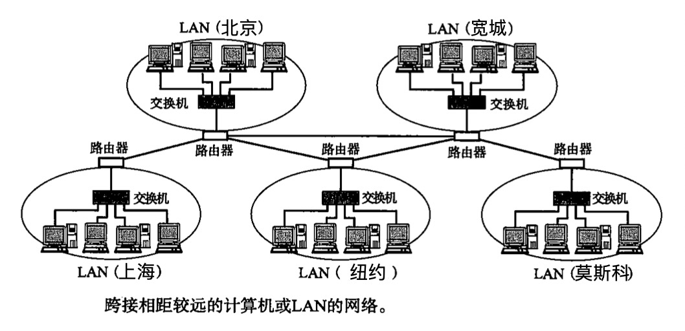

# 第 1 章 网络基础知识

计算机与网络发展历史及标准化过程、OSI参考模型、网络概念本质、网络构件的设备

## 计算机网络出现的背景

起初，计算机以**单机模式**被广泛使用，也叫独立模式，即未连接到网络、各自独立使用的方式

将一个个计算机连接在一起，即形成**计算机网络**，根据规模分为 WAN（Wide Area Network，广域网） 和 LAN（Local Area Network，局域网）

最初是由管理员将特定的几台计算机连到一起形成计算机网络，是私有的网络，后来人们不断尝试将私有网络相互连接形成更大的私有网络，之后又逐渐演变成为互联网，互联网中的任何两台计算机都能通信，再后来各种各样的终端都接入互联网，形成现在的综合通信环境。

计算机网络就好比人的神经系统，神经能将各处的感觉传递到大脑，网络能将世界各地的信息传递到你的计算机中。

## 计算机与网络发展的 7 个阶段

了解计算机与网络发展的历史与现状，能更好的理解 TCP/IP 的重要性

年代            | 内容
:--------------|:----------------------
20 世纪 50 年代 | 批处理时代
20 世纪 60 年代 | 分时系统时代
20 世纪 70 年代 | 计算机间通信时代
20 世纪 80 年代 | 计算机网络时代
20 世纪 90 年代 | 互联网普及时代
2000 年         | 以互联网为中心的时代
2010 年         | 无论何时何地一切皆 TCP/IP 的网络时代

### 批处理（Batch Processing）

20 世纪 50 年代

事先将用户程序和数据装入卡带或磁带，并由计算机按照一定的顺序读取，使用户所要执行的这些程序和数据能够一并批量得到处理的方式

这种计算机价格昂贵体积巨大，通常放置于专门进行计算机管理于运维的计算机中心，用户除了事先将程序和数据装入卡带或磁带带到中心去运行之外别无他法

操作相当复杂，有专门的操作员负责实际运行程序，用户较多时只能过些时日再来取结果

彼时的计算机主要用于大规模计算或处理，不是普通人使用的工具

### 分时系统（Time Sharing System，TSS）

20 世纪 60 年代出现

多个终端（由键盘、显示器等输入输出设备组成）与同一个计算机连接，允许多个用户同时使用一台计算机的系统

彼时计算机造价昂贵，无法一人一台，分时系统则可以假装“一人一台”，用户感觉“完全是自己在使用一台计算机”，这体现了分时系统的**独占性**

> 分时系统的重要特性：**多路性**、**独占性**、**交互性**、**及时性**

它的交互式（对话式）操作使计算机变得更加人性化，并且促进了像 BASIC 这样能够与计算机实现交互的编程语言的发展，而在此之前的 COBOL 和 FORTRAN 等计算机编程语言都必须以批处理系统为基础才能开发和运行

> BASIC 语言的发明是为了让更多的人学习如何编程，可以说是关注分时系统的初学者们的必学语言

此时每个终端与计算机之间通信线路构成了星型结构，从这时开始，网络通信与计算机之间的关系开始显现。小型机随集产生，办公场所与工厂也逐渐引入计算机

分时系统中一个计算机与多个终端使用通信线路连接，但两个计算机之间还是无法连接

### 计算机之间的通信

20 世纪 70 年代，计算机性能飞速发展，体积小型化，价格急剧下降，企业也开始使用，为了提高工作效率，人们开始研究计算机之间的通信技术

> 计算机之间通信技术诞生前，计算机间转移数据需要使用磁带、软盘等外部存储介质

### 计算机网络的产生

20 实际 80 年代

能够连接各式各样的计算机的网络诞生

窗口系统的发明让人们更加便捷的使用计算机，拉近与网络的距离，开始愉快的网上冲浪，享受网上的丰富资源

### 互联网的普及

20 世纪 90 年代

连接异构型计算机的通信网络技术就是现在的互联网技术，此时万维网（World Wide Web，WWW）等信息传播方式也迎来了大发展，互联网进入每个家庭内部

> **瘦身**
> 
> 20 世纪 90 年代上半叶，由于使用个人电脑与 UNIX 工作站搭建网络比大型主机更有优势，操作简单且价格低廉，由此引发了一个旨在降低网络架构成本的新趋势，被称为“瘦身”

### 以互联网技术为中心的时代

许多发展道路各不相同的网络技术都向互联网靠拢。

例如，电话网曾经一直作为通信基础设施、支撑通信网络，其地位目前已被 IP（Internet Protocol）网所取代，而 IP 网本身就是互联网技术的产物。通过 IP 网，不仅可以实现电话通信、电视播放，还能实现计算机间的通信，建立互联网。而且能联网的设备也是扩展到了各种电子产品。

### 从“单纯简历连接”到“安全简历连接”

互联网给了我们高度便捷的信息网络环境，正成为社会基础设施建设中最基本的要素之一，但其也带来了负面问题，如计算机病毒、信息泄露、网络欺诈等等。

故而现在人们更加追求安全建立连接

### 手握金刚钻的 TCP/IP

能够使许多独立发展的网络通信技术融合并实现统一的正是 TCP/IP 技术，它是通信**协议**的统称

## 协议
