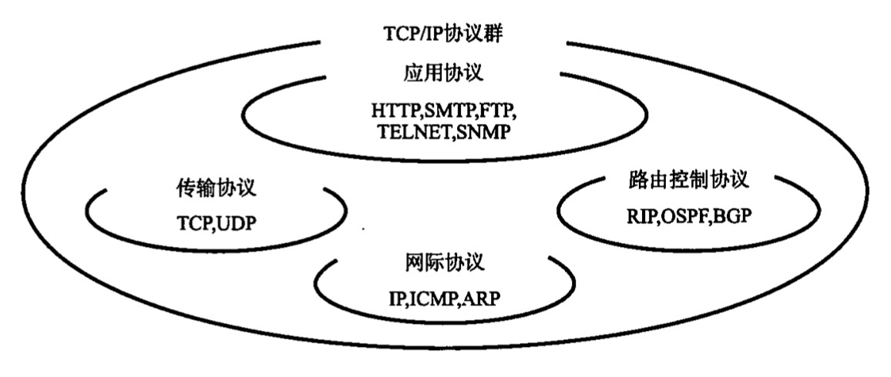

# 第 2 章 TCP/IP 基础知识

Transmission Control Protocol、Internet Protocol

## TCP/IP 出现的背景及其历史

20 世纪 60 年代，以美国国防部（The Department of Defense，DoD）为中心的组织开始着力于研究心得通信技术。希望在通信传输中，即使遭到了敌方的攻击破坏，也可以经过迂回线路实现最终通信，分组交换技术应运而生

ARPANET（Advanced Research Projects Agency Network，阿帕网）是他们实验的网络，并取得超前的成功，证明了分组交换技术的通信方法是可行的，它是互联网的鼻祖

ARPANET 中的一个研究机构于 20 世纪 70 年代前半叶研发出了 TCP/IP，到 1982 年具体规范被确定，1983 年成为 ARPANET 网络中唯一指定的协议。1980 年在使用 ARPANET 的大学、机构中出现 BSD UNIX，它实现了 TCP/IP 协议，随着 UNIX 工作站的普及，TCP/IP 也迎来盛行之时。

## TCP/IP 的标准化

TCP/IP 是一系列协议的统称，如 IP 与 ICMP、TCP 与 UDP、TELNET 与 FTP、HTTP 等。也称为网际协议族（Internet Protocol Suite）

TCP/IP **标准化过程中特点**：

- **具有开放性**：由允许任何人加入的 IETF 讨论制定
- **注重实用性**：实现真正能够通信的技术的重要性大于制定某一协议的规范本身。大致规范定下后就开始实现协议进行通信，发现问题讨论修改

**RFC**（Request For Comment），记录了 IETF 需要讨论、已经讨论的各种协议的文档

- IP 协议由 RFC279 制定
- TCP 协议由 RFC793 制定

扩展、修改已有协议都要新建 RFC，比较麻烦，因此采用 STD（Standard）方式管理编号。STD 用来记载哪个编号制定哪个协议，即使协议规范内容改变也不会改变 STD 编号，只是其中记录的 RFC 编号视情况增减即可

IETF 每年组织 3 次会议，平时都是通过邮件组形式进行讨论，且邮件组不限制订阅

### TCP/IP 标准化流程

1. **互联网草案**阶段，有效期 6 个月，否则自动消除
2. 经 IESG（IETF Engineering Steering Group，由 IETF 主要成员构成）批准编入 RFC 文档进入**提议标准**（Proposed Standard，也是此文档的名称）阶段
3. 协议从上一阶段开始被众多设备应用，如能得到 IESG 认可，即能成为**草案标准**（Draft Standard），如遇到问题则在此之前修订
4. 更多地设备实现和应用此协议，且所有参与该协议指定的人都觉得它“实用性强，没有什么问题”，并得到 IESG 最终批准，即可以成为**标准**

## 互联网基础知识

指由 ARPANET 发展而来、互连全世界的计算机网络，其英文单词 The Internet 也成为固有名词，而 Internet 现在一般指网际网

与 TCP/IP 的关系：TCP/IP 本就是为使用互联网而开发指定的协议族，互联网的协议就是 TCP/IP，TCP/IP 就是互联网的协议

连接全世界的互联网是由很多区域网络组成的，区域网络又由更小的区域网络或机构内部网络构成。每个网络都由骨干网（BackBone）和末端网（Stub）组成。每个网络之间通过 NOC（Network Operation Center，网络操作中心）相连。如果网络运行商不同，网络连接方式、使用方法也会不同，连接异构网络需要 IX（Internet Exchange，网络交换中心）的支持。互联网就是众多异构网络通过 IX 互连的一个巨型网络

## TCP/IP 协议分层模型

### 与 OSI 参考模型对比

### 硬件（物理层）

负责数据传输的硬件，如以太网或电话线路等，把各种设备连起来

### 网络接口层（数据链路层）

此层也可以与硬件层合成**网络通信层**

此层利用硬件来进行通信，可以类比为驱动程序，有了硬件要有软件才能工作

### 互联网层（网络层）

此层使用 IP 协议，相当于 OSI 参考模型中的第 3 层网络层，IP 协议基于 IP 地址转发分包数据，IP 协议的作用是将分组数据包发送到目的主机

连接互联网的所有主机、路由器都必须实现 IP 的功能，其他网络设备如网桥、中继器或集线器则不必须实现

#### IP

跨越网络传送数据包，使整个互联网都能收到数据的协议，此期间使用 IP 地址作为主机标识，不具有重发机制，属于**非可靠性传输协议**

#### ICMP

IP 数据包发送途中出现异常无法到达目的地时，要给发送端一个异常通知，有时被用于诊断网络健康状况

#### ARP

从分组数据包的 IP 地址中解析出 MAC 地址的协议

### 传输层

让应用程序之间实现通信，区分计算机中的不同程序使用的是端口号

#### TCP

面向有连接的传输层协议，保证双端通信主机之间通信可达，能正确处理丢包、乱序等情况

TCP 能有效利用带宽，缓解网络拥堵

为了建立和断开连接，有时需要至少 7 次的收发包，导致流量的浪费，而且为了提高网络利用率，其中定义了各种复杂规范，因此不利于视频会议（视频、音频的数据量既定）等场合

#### UDP

面向无连接的传输层协议，常用于分组数据较少或多播、广播通信及视频通信等多媒体领域

### 应用层（会话层以上的分层）

TCP/IP 多应用于客户端/服务器架构中，客户端发送请求给服务器，并接收来自服务器的响应

#### WWW

浏览器通过 HTTP（HyperText Transfer Protocol）与服务端通信，主要传输 HTML（HyperText Markup Language）数据，WWW 中的 HTTP 属于 OSI 应用层的协议，而 HTML 属于表示层的协议

#### E-Mail

使用 SMTP（Simple Mail Transfer Protocol）协议，最初只能发送文本格式，后由 MIME 协议扩展后就可以发送声音、图像、带格式文字等信息，这里的 MIME 即属于 OSI 参考模型的第 6 层——表示层的协议

#### 文件传输（FTP）

File Transfer Protocol，用于文件传输，传输过程中可以选择用二进制方式或文本方式。而文本方式在不同操作系统之间进行时，会自动修改换行符，这也属于表示层的功能

在 FTP 传输过程中会建立两个 TCP 连接，分别为控制连接和数据连接，这两种连接的控制管理属于会话层的功能

#### 远程登录（TELNET、SSH）

TELetypewriter NETwork、Secure SHell，登录到远程的计算机上来运行程序

#### 网络管理（SNMP）

Simple Network Management Protocol，在 TCP/IP 中进行网络管理，接受联网设备的信息通知、通知设置、故障通知，并进行远程修改配置、检查是否正常运行

使用 SNMP 管理的主机、网桥、路由器都称为 SNMP **代理**（Agent），管理的那一端叫做**管理器**（Manager），SNMP 就是 Manager 与 Agent 之间用到的协议

管理端使用 **MIB**（Management Information Base）来访问代理端中保存的网络接口信息、通信数据量、异常数据量、设备温度等信息。在 TCP/IP 的网络管理中，SNMP 属于应用层协议，MIB 则属于表示层协议

## TCP/IP 分层模型与通信示例

### 数据包首部

每个分层都会为数据附加首部，以包含该层必要的信息。**首部**就是为该层协议提供信息部分，**数据**就是该层要发送的内容，当然从下一层的角度看，上一层收到的包（由上一层的首部和上一层要发送的数据构成）整个被认为是本层的数据
