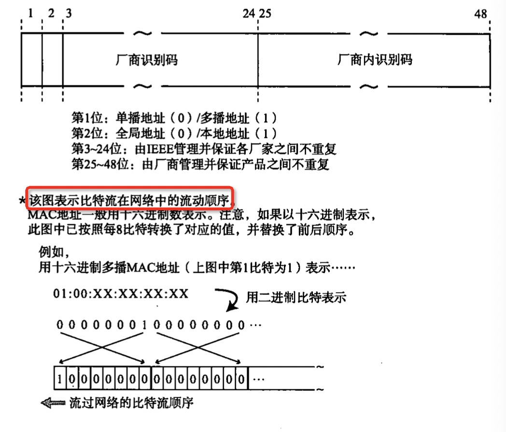
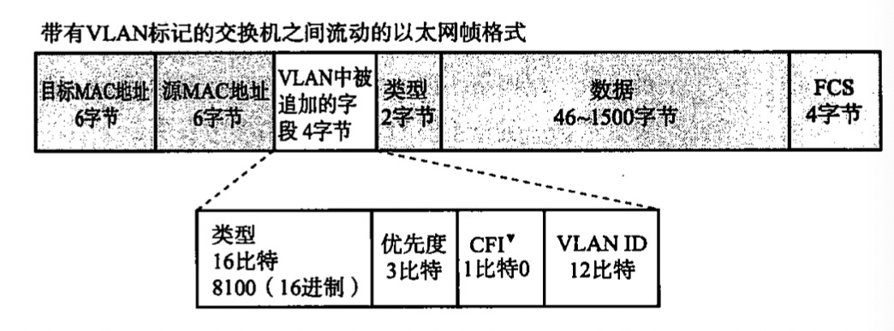

# 第 3 章 数据链路

## 数据链路的作用

TCP/IP 没有对数据链路层及以下做定义，认为这两层的功能是透明的，但想要深入理解 TCP/IP 与网络就需要数据链路的知识

**数据链路层的协议定义了通过通信媒介互联的设备之间传输的规范**。通信媒介有双绞线电缆、同轴电缆、光纤、电波、红外线等介质，另外设备间也会通过交换机、网桥、中继器等中转数据

计算使用二进制表示信息，实际的通信媒介使用电压高低、灯山灭、电波强弱等表示信息，这两种信息之间的转换正是物理层的责任。数据链路层处理的数据也不是单纯的 0、1 序列，而是将他们集合为一个叫做“帧”的数据块后进行传输

可将数据链路视为**网络传输中的最小单位**，互联网可以称为“**数据链路的集合**”

> 数据链路的**段**
> 
> **指一个被分割的网络**，观察角度不同其范围也不同
> 
> 例如使用中继器将两条网线组成一个网络，从网络层（逻辑上）看，两条网线属于一个网络，是一个段；从物理层看，两条网线分属于两个段

> **网络拓扑**（Topology）
> 
> 指网络的连接和构成的形态，有总线型、环形、星型、网状型等，目前实际的网络都是由这些简单的拓扑结构错综复杂的组合而成的
>
> > **拓扑**一词既可用于描述物理上的配线方式，也可描述逻辑上的网络结构

## 数据链路相关技术

### MAC 地址

**MAC 地址用于识别数据链路中互连的节点**

以太网、FDDI、ATM、无线 LAN、蓝牙等都是**根据 IEEE 的相关协议规范使用** MAC 地址的

> - **FDDI**，Fiber Distributed Data Interface，光纤分布式数据接口
> - **ATM**，Asynchronous Transfer Mode，异步传输模式。以信元为基础的一种分组交换和复用技术，面向连接的传输模式，高速数据传输率，支持多种类型（声音、数据、传真、CD、视频等等）
> - **IEEE**，美国电气和电子工程师协会，也可读作“I triple E”，IEEE802 是专门制定局域网标准化相关规范的组织，如 IEEE802.3 是关于以太网的工作小组，具体的某个标准/协议则是在工作小组名后再加字母。
>   - 叫 802 是因为于 1980 年 2 月启动的局域网国际标准化项目

通过 MAC 地址判断目标地址：

MAC 地址**长 48 比特**（6 字节，常用十六进制表示（此时长 12 个字符）），一般在全世界不重复。在使用网卡情况下，其一般被烧入到 ROM 中

> - **ROM**，Read-Only Memory，**只读存储器**。以非破坏性读出方式工作，只能读出无法写入，掉电后信息依然存在，也称为**固定存储器**
> - **烧入**，指将程序或数据写入到存储器中
>   - 最初用于一次性可编程只读存储器上，使用远高于正常读取电压的电压来强行改变内部物理结构实现程序写入，再用高电压将写入电路烧断保证无法二次写入。后来的一次性光盘也是用远高于正常读取功率的大功率来强行改变表面结构
>   - 随着技术发展，现代存储器一般可以多次写入，写入原理也不再是永久性改变，但烧这个词还是保留了
> - **唯一性**，只要不在一个数据链路中，MAC 地址重复也不会出现问题。如微机板是可以我们自己设置 MAC 地址的，如虚拟机的 MAC 地址也是虚拟软件自己设的，这就完全可能跟世界上某个 MAC 地址重复

IEEE802.3 规定的 MAC地址格式：

### 共享介质型网络

根据通信介质的使用方法分类，网络可分为**共享介质型**和[**非共享介质型**](#非共享介质网络)

共享介质型指**多个设备共享一个通信介质**的网络，例如最早的以太网和 FDDI，设备之间使用同一个载波信道进行发送和接受。基本上采用**半双工通信**方式，并需要对介质进行访问控制。访问控制方式有**争用方式**和**令牌传递方式**

#### 争用方式（Contention）

指争夺获取数据传输的权利的方式，也称 **CSMA**（Carrier Sense Multiple Access，载波监听多路访问）

各个**站**（数据链路中称节点为站）采用先到先得的方式占用信道发送数据

若多个站同时发送，则产生冲突，会导致网络拥堵和性能下降。

#### CSMA/CD

Carrier Sense Multiple Access with Collision Detection

改良的 CSMA，在一部分以太网中使用

原理：要求各个站提前检查冲突，没有冲突则可以发送数据，如果在发送数据时检测到冲突，就发送一个特殊的 32 位的阻塞报文信号后立即停止发送，释放信道，随机延时一段时间后再重新争用介质。以同轴电缆为例，检查冲突是通过线路中的电压检测，一旦电压超出规定范围，就认为是发生了冲突

#### 令牌传递方式

沿着**令牌环**发送称为**令牌的特殊报文**进行传输控制，仅持有令牌的站能发送数据

**特点**：
- 不会有冲突
- 每个站都有平等循环获得令牌的机会

**网络拥堵也不会对性能下降**，不过由于没有令牌不能发送数据，因此在网络不拥堵时数据链路的利用率达不到 100%，为此诞生了多种令牌传递技术以尽可能提高网络性能

令牌控制的数据传输:

### 非共享介质网络

不共享介质，对介质专用。**每个站直连交换机，由交换机负责转发数据帧**，发送端与接收端不共享通信介质，多**采用全双工通信**方式。如 ATM。非共享最近（书中）成为了以太网的主流方式。

用交换机构建网络，计算机与交换机端口（计算机设备的外部接口都叫做**端口**，注意区别于传输层协议的端口）一对一连接，即可实现全双工通信。**不会发生冲突**，因此**通信更高效**

**缺点**是交换机一旦故障则所有计算机之间都无法通信（所有星型体系共有的缺点）

> **半双工全双工**
> 
> **半双工指只发送或只接收的通信方式，全双工指同一时间即可发送也可接收数据的方式**

### 根据 MAC 地址转发

**交换集线器**，使用集线器或集中器以星型连接多个主机，也叫**以太网交换机**，它就是具有多个端口的网桥，可以根据帧的目标 MAC 地址决定从哪个网络接口发送数据，这时参照的是**转发表**（Forwarding Table）

**自学过程**：转发表内容无需手动设置，可以自学。每个帧中包含发送方地址，将其与来源接口对应并记录到转发表中，以后再有到这个地址的即知道通过哪个接口发送。数据的目的地址若不在转发表中，则都发，谁接收了（只有数据的目的地址与自己相同，计算机才会接收数据），就记下接收的端口和目的地址的组合。这样就可以完成所有地址与端口对应的学习。

由于 MAC 地址没有层次性，当设备增多时转发表就变得更大，检索所需时长就更长，所以**当连接较多终端时，有必要将网络分成多个数据链路，采用类似网络层的 IP 地址一样对地址分层管理**

> **交换机转发方式**：**存储转发**、**直通转发**
> 
> 存储转发会检查帧末尾的 FCS 位，可以避免冲突、噪声导致的错误帧。直通转发延迟更短

### 环路检测技术

若网络中出现环路，最坏的情况下数据帧将在环路中持续转发，造成网络风暴导致网络瘫痪。生活中可将连接路由器的网线上的 4 对线对接来制造环路，瘫痪整个局域网，一般上层网络当将测到某子网有环路的话一般会断开与之的连接，避免影响更大的网络

解决环路有**生成树**和**源路由**两种方式，具有这些功能的网桥即使构建了环路也不会出现大问题。合适的环路可以分散网络流量，提高容灾能力

#### 生成树

通过检查网络的结构、进制某些端口的使用可以有效消除环路。然而改端口可以作为发生问题时可绕行的端口

> 由 IEEE802.1D 定义，网桥必须在每 1~10 秒内互相交换 BPDU 包，判断端口的使用情况，以便消除环路。一旦发生故障，自动切换通信线路，使用没用着的端口继续传输，但切换需要几十秒时间，IEEE802.1W 定义了 RSTP 的方法以缩短切换时间

#### 源路由

判断发送数据的源地址是由哪个网桥实现传输的，并将帧写入 RIF，因此可以根据这个 RIF 信息避免重复发送相同数据帧

### VLAN

交换机按照端口区分多个网段的技术，即为 VLAN。可以区分广播数据传播的范围，减少网络负载，提高网络的安全性。并且在网管修改网络拓扑结构时也方便很多，无需进行硬件线路的改造了。

由于异构的两个网段之间需要具有路由功能的交换机，或者在各段中间通过路由器连接。此时使用的是 TAG VLAN 标准，它的每个网段都有一个标识 VLAN ID，数据帧首部要加上这个 VID 标识以表明数据是要发送给哪个网段的

## 以太网（Ethernet）

> Ethernet 源于 Ether（以太），意为介质。在爱因斯坦剔除量子力学前，人们普遍认为宇宙空间充满以太，并以波的形式传送光

众多数据链路中，以太网使用最广泛，规范简单，易于网卡即驱动程序实现

一半的以太网与 IEEE802.3 规范化的以太网在帧格式上有所不同，后者被称为 802.3 以太网

### 以太网连接形式

最初使用多台终端使用同一根同轴电缆的共享介质型连接方式，现在使用终端与交换机间独占电缆的方式

### 以太网分类

命名格式：<传输速度>BASE<传输介质代号>

如 10BASE2 表示速率为 10Mbps 使用同轴电缆，10GBASE-T 表示 10Gbps 速率使用双绞线

> 以太网中以时钟频率决定传输速度，1K = 1000，1M = 1000K，1G = 1000M

连接网络时，传输速度相同而电缆不同的情况下，可以使用允许不同传输介质的中继器或集线器。传输速度不同时，必须使用允许变速的设备如网桥、交换集线器、路由器

### 以太网历史

最初使用半双工通信，控制方式使用 CSMA/CD，后来这成为了限制以太网高速化的瓶颈，以至于人们一度想要放弃以太网

随着技术进步采用与交换机直接连接的方式，速度就上来了，现在以太网已成为最具兼容性与未来发展性的一种数据链路

### 以太网帧格式

依次为前导码、首部、数据、FCS

**前导码**（Preamble），在以太网帧的前端，由 **1、0 交替组成的 64 位**数据（其末尾 `11` 不是 `10`），**表示一个以太网帧的开始**，也是对端网卡能够确保与之同步的标志

前导码末尾的 `11` 称为 **SDF**（Start Frame Delimiter），表示之后是帧的本体

**14 字节首部** = 【6 字节目标 MAC 地址】+【6 字节源 MAC 地址】+【2 字节上层协议类型】

**数据**范围为 46~1500 字节

**FCS**（Frame Check Sequence，帧检测序列）长 4 字节，其中保存着整个帧除以生成多项式的余数，具有较强的检错能力，接收端用同样方式计算后对比就可以检查帧是否损坏

与 802.3 以太网帧对比如下图，其中上层协议类型在 SNAP 中：

> 数据量路层再分层：**介质访问控制层**、**逻辑链路控制层**
> 
> 分别根据以太网、FDDI 等不同数据链路所特有和所共有的首部信息进行控制
> 

另外带有 VLAN 标记的交换机之间以太网帧格式如下：

## 无线通信
